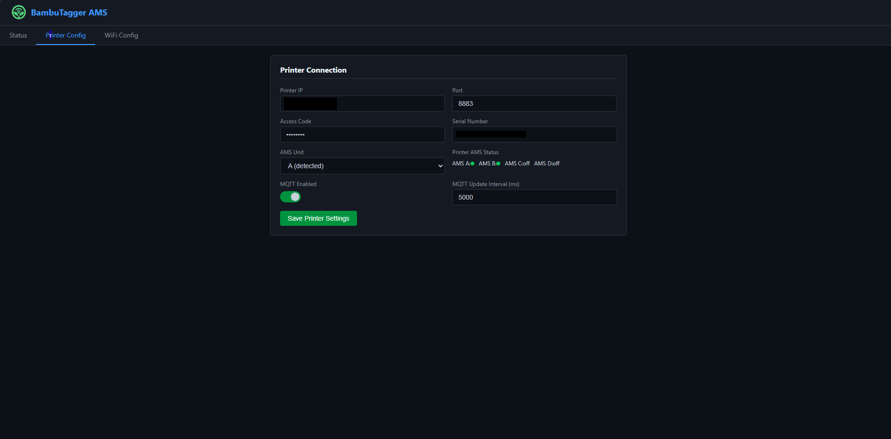
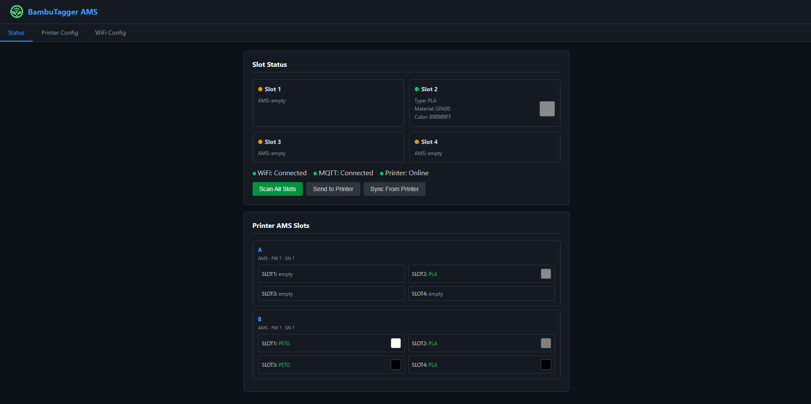
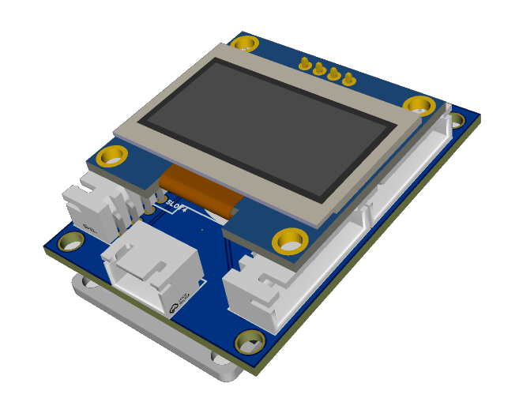

#   BambuTagger-AMS

Multi-spool NFC tag reader for Bambu Lab printers. Reads 4 Bambu Lab filament spool tags via RC522, displays live printer AMS tray data over MQTT, and sends RFID tag data to the printer/BMCU. Fully configurable via web interface with automatic AP fallback and OTA firmware updates.

<p align="center">



</p>

## Features

- **4x RC522** on shared SPI bus polling MIFARE Classic 1K + NTAG tags via `MFRC522-spi-i2c-uart-async`
- **Multi-tag auto-detect** — MIFARE Classic 1K (Bambu Lab) or NTAG (SpoolEase), auto-routed to correct parser
- **HKDF-SHA256 key derivation** — derives per-sector MIFARE keys from the tag UID using Bambu's KDF salt
- **Live printer AMS sync** — reads tray data (material, color, type) from the printer over MQTT
- **Bambu BMCU support** — sends `ams_filament_setting` with correct `tray_type`, `tray_color`, `nozzle_temp_min/max`
- **NTAG / SpoolEase** — reads NDEF URI records, extracts spool data from `tag.spoolease.io` URLs
- **Web interface** — 3-tab SPA: Status (merged slots + Sub type + color swatches), Printer Config, WiFi Config
- **OLED display** — boot splash, live AMS tray data, OTA progress bar, MQTT+PTR status
- **4x WS2812 LEDs** — per-slot color from printer AMS tray data (live MQTT sync)
- **Boot splash**: 2-second logo display from `Logo/splash.png`
- **MQTT bridge** — subscribes to printer status, publishes `ams_filament_setting` commands
- **Auto AP fallback** — captive portal on `192.168.4.1` when WiFi is unavailable
- **OTA updates** — one-click firmware update from GitHub Releases, OLED progress bar, web overlay with status
- **GitHub Actions** — CI build on commit, merged binary + OTA binary release on version tags

## Hardware

- **ESP32** Dev Module
- **4x RC522** RFID/NFC readers (SPI, shared bus)
- **4x WS2812** addressable LEDs (daisy-chained, single data pin)
- **128x64 OLED** SSD1306 I2C display

### Wiring

| Component       | ESP32 Pin |
|-----------------|-----------|
| **SPI MOSI**    | GPIO 23 |
| **SPI MISO**    | GPIO 19 |
| **SPI SCK**     | GPIO 18 |
| RC522 #1 SS     | GPIO 13 |
| RC522 #2 SS     | GPIO 12 |
| RC522 #3 SS     | GPIO 14 |
| RC522 #4 SS     | GPIO 27 |
| RC522 #1 RST    | GPIO 26 |
| RC522 #2 RST    | GPIO 25 |
| RC522 #3 RST    | GPIO 33 |
| RC522 #4 RST    | GPIO 32 |
| **WS2812 data** | GPIO 15 |
| **OLED SDA**    | GPIO 21 |
| **OLED SCL**    | GPIO 22 |

All RC522 share the same SPI bus (MOSI, MISO, SCK). Each has its own SS and RST pin.

### Slot Mapping

| RC522 # | SS Pin | Slot | WS2812 Pixel |
|---------|--------|------|--------------|
| 1 | 13 | 1 | 0 |
| 2 | 12 | 2 | 1 |
| 3 | 14 | 3 | 2 |
| 4 | 27 | 4 | 3 |

## Software Setup (Arduino IDE)

1. Install **ESP32 board package**:  
   File → Preferences → Additional Board Manager URLs:  
   `https://espressif.github.io/arduino-esp32/package_esp32_index.json`  
   Then Tools → Board → Boards Manager → search "ESP32" → install.

2. Install required libraries via **Tools → Manage Libraries**:
   - **MFRC522-spi-i2c-uart-async** — multi-reader SPI sharing (not standard MFRC522)
   - **Adafruit NeoPixel** by Adafruit (v1.12+)
   - **Adafruit GFX Library** by Adafruit (v1.11+)
   - **Adafruit SSD1306** by Adafruit (v2.5+)
   - **PubSubClient** by Nick O'Leary (v2.8+)
   - **ArduinoJson** by Benoit Blanchon (v6.x or v7.x)
   - **mbedTLS** — bundled with ESP32 core, used for HKDF-SHA256

3. Open `BambuTagger-AMS.ino`, select **ESP32 Dev Module** as board, and upload.

## WiFi & AP Mode

On first boot (or if saved WiFi credentials are invalid), the device automatically opens an access point:

| Scenario | Behavior |
|----------|----------|
| No WiFi configured | Opens AP immediately |
| WiFi connection fails | Opens AP after 15 seconds |
| AP active, credentials exist | Retries STA connection every 30 seconds |
| STA connects while AP active | Closes AP, switches to normal mode |

- **SSID**: Device name (default: `BambuTagger-AMS`)
- **Security**: Open (no password)
- **IP**: `192.168.4.1`
- **Captive portal**: DNS redirects all domains to the config page

## Web Interface

Available at `http://<esp32-ip>` on your network, or `http://192.168.4.1` in AP mode.

### Status Tab
- **Merged Slot Status** — each slot shows AMS data (Type, Sub, Material, Color) + scanned tag data
- **Color swatches** — 36x36px right-aligned per slot
- **Tag info row** — `Tag: PLA Basic - GFA00 · C12E1FFF · 1000g/1000g`
- **Printer AMS Cards** — all detected AMS units with tray grids
- **Update Firmware** — one-click OTA from GitHub Releases

### Printer Config Tab
- Printer IP, Port (default 8883), Access Code, Serial Number
- **AMS Unit selector** (A/B/C/D)

### WiFi Config Tab
- SSID, Password, Device Name

### Footer
- Sticky footer: `© 2026 by VID-PRO` with link to [www.vid-pro.de](https://www.vid-pro.de)

## OLED Display (128x64)

```
┌──────────────────────────────────┐
│ Device Name                WiFi │
├──────────────────────────────────┤
│ 1: PLA   #C0C0C0FF              │  ← AMS tray data
│ 2: empty                        │
│ 3: empty                        │
│ 4: empty                        │
├──────────────────────────────────┤
│ MQTT:OK                   PTR:OK│
└──────────────────────────────────┘
```

OTA progress shown on OLED with header/footer preserved:
"OTA Update" → "Downloading..." → "Flashing... 45%" → auto-reboot

## Printer Communication

### Subscribe
- **Topic**: `device/<serial>/report`
- **Data**: `push_status` (periodic, ~3KB), `get_version` responses

### Publish
- **Topic**: `device/<serial>/request`
- **`ams_filament_setting`** — structure:
  ```json
  {
    "print": {
      "sequence_id": "0",
      "command": "ams_filament_setting",
      "ams_id": 0,
      "tray_id": 0,
      "tray_info_idx": "GFA00",
      "tray_color": "RRGGBBFF",
      "nozzle_temp_min": 190,
      "nozzle_temp_max": 230,
      "tray_type": "PLA"
    }
  }
  ```
- `tray_type` derived from filament index prefix (GFA→PLA, GFG→PETG, etc.)
- `tray_color` forced to RRGGBBFF format
- `nozzle_temp_min/max` from tag block 6

## Tag Format & Reading

### Bambu Lab (MIFARE Classic 1K)

Bambu Lab uses **MIFARE Classic 1K** tags with fixed block offsets:

| Block | Content |
|-------|---------|
| 0 | UID (4 bytes) |
| 1 | Variant ID + Material index (e.g. "GFA00") |
| 2 | Filament type short name |
| 4 | Detailed type string (e.g. "PLA Basic") |
| 5 | RGBA color (bytes 0-3) + spool weight LE (bytes 4-5) |
| 6 | Nozzle temps (bytes 8-11 LE) |

### SpoolEase (NTAG)

SpoolEase uses **NTAG** tags with NDEF URI records. The URL contains encoded spool data:

`https://tag.spoolease.io/S1/?TG=...&M=PLA&CC=000000FF&SC=GFL99&WL=1000&WE=179&WF=1215&NN=190&NX=240`

URL parameters parsed and mapped to SpoolInfo:

| Param | Field | Description |
|-------|-------|-------------|
| `M=` | display type | e.g. "PLA", "PETG" |
| `SC=` | `materialType` | Bambu index for MQTT (e.g. "GFL99") |
| `CC=` | `colorHex` | RGBA hex (e.g. "000000FF") |
| `B=` | `manufacturer` | Brand name (e.g. "Jayo") |
| `WL=` | `remainingGrams` | Remaining filament weight |
| `WE=` | empty spool | Empty spool weight |
| `WF=` | full spool | `totalGrams = WF - WE` |
| `NN=` | `nozzleTempMin` | Min nozzle temp °C |
| `NX=` | `nozzleTempMax` | Max nozzle temp °C |

Reading uses NDEF TLV parsing:
- NDEF Message TLV (0x03) → NDEF record with TNF=WellKnown, type="U"
- URI identifier code byte prepended to URI string
- Non-printable bytes terminate the URI scan
- Spool ID extracted from URL path after last `/`

### Authentication & Reading
- **Tag auto-detect**: SAK-based type detection (MIFARE 1K vs NTAG)
- **HKDF-SHA256** derives 16 per-sector Key A/B from 4-byte UID
- Bambu KDF salt/info vectors from reverse-engineered firmware
- Falls back to default key `0xFF...FF` for blank sectors
- Failed auth re-wakes tag via antenna power-cycle
- Dead readers auto-skipped (version register 0x92/0x91/0xB2 check)
- SPI: 1 MHz via `MFRC522_SPI`
- NTAG: page-level reads (page+=4, 4 pages per MIFARE_Read)

### Filament Type Mapping
| Prefix | Type |
|--------|------|
| GFA-GFE, GFL | PLA |
| GFG | PETG |
| GFH, GFI | ABS |
| GFJ | ASA |
| GFK | TPU |

## OTA Updates

- **Button**: "Update Firmware" on Status page (shows "Update to vX.Y.Z" or "up to date")
- **Overlay**: full-screen progress overlay with spinner, status text, progress bar
- **Endpoint**: `POST /api/ota` triggers update, `GET /api/ota-check` checks for newer version
- Downloads latest `.ino.bin` from GitHub Releases, flashes via `Update.h`
- 3 retry attempts with 5s stall detection, fresh HTTP client per attempt
- OLED shows "Checking version..." → "Downloading..." → "Flashing..." with percentage
- Device auto-reboots after successful flash, web UI auto-reloads

## CI / CD

Workflow at `GHActions/release.yml`:
- **On push/PR**: compiles sketch, uploads artifacts
- **On release tag**: creates merged flash binary + OTA binary, attaches to GitHub Release
- Arduino cache for fast rebuilds, pinned esp32:esp32@3.0.7 core

## Configuration Defaults

| Setting | Default |
|---------|---------|
| WiFi SSID | (empty) |
| WiFi Password | (empty) |
| Device Name | BambuTagger-AMS |
| Printer IP | 192.168.1.100 |
| Printer Port | 8883 |
| Access Code | (empty) |
| Printer Serial | (empty) |
| AMS Unit | A (0) |
| MQTT Enabled | No |
| MQTT Update Interval | 5000 ms |
| RFID Poll Interval | 100 ms |
| Firmware Version | 1.0.3 |

